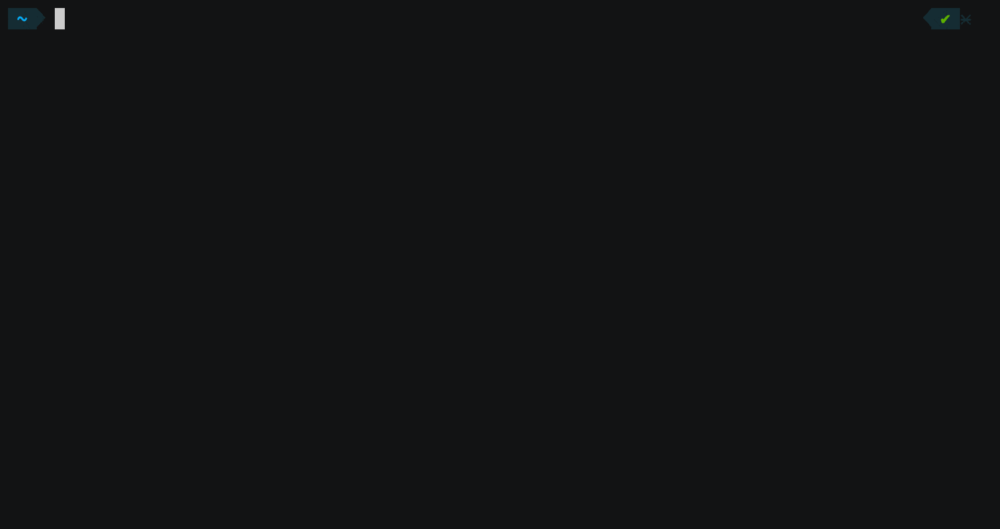
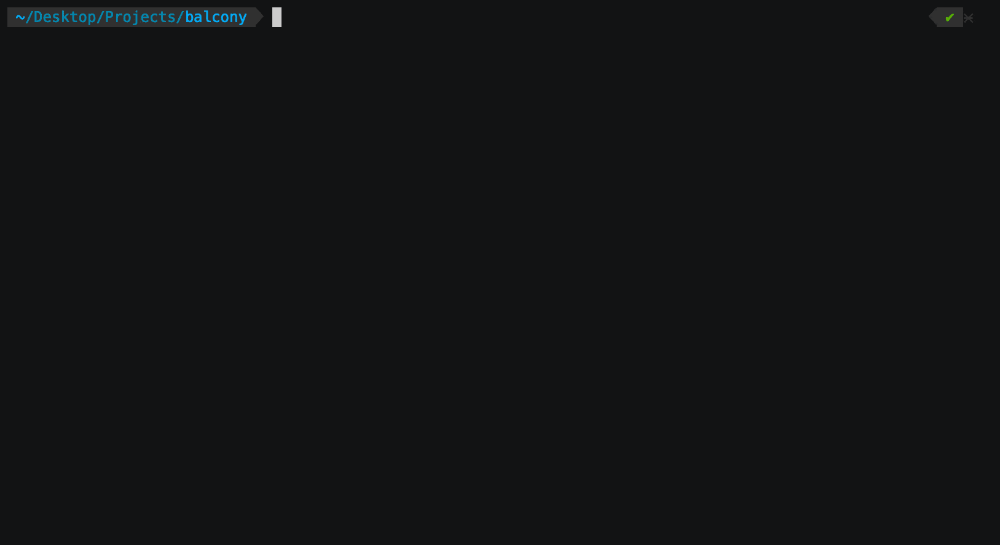

# Features

## balcony `terraform-import` Features

## balcony `terraform-import` on Docker Features

### ec2 Instances Example

## balcony `terraform-wizard` Features

### ec2 SecurityGroups Example

## balcony Features

### List available AWS Services

Use `balcony aws` to see every AWS service available.

### List Resource Nodes of an AWS Service

Use `balcony aws <service-name>` to see every Resource Node of a service.

### Reading a Resource Node

Use `balcony aws <service-name> <resource-node>` to read operations of a Resource Node.

### Documentation and Input & Output of Operations

Use the `--list`, `-l` flag to print the given AWS API Operations documentation, input & output structure.

### Enable Debug messages

Use the `--debug`, `-d` flag to see what's going on under the hood!

