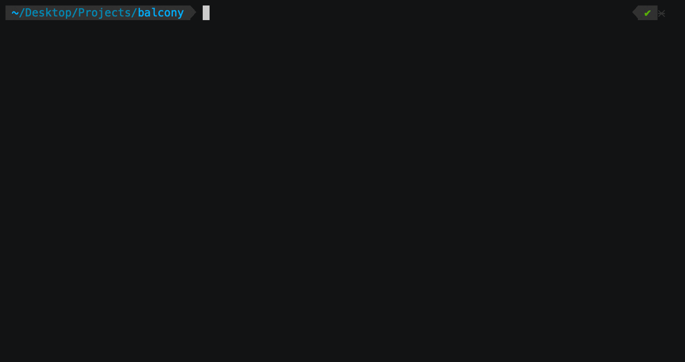

# balcony

[Documentation](https://oguzhan-yilmaz.github.io/balcony/)

[See QuickStart Page to get started.](quickstart.md)

Balcony is a CLI tool that simplifies the process of querying AWS resources for developers who use AWS. 

By dynamically parsing `boto3` library and automatically filling in required parameters, Balcony allows developers to quickly and easily list all of their AWS resources. 

Balcony is particularly useful for reading AWS resources, as it saves developers time and effort by automatically finding and filling in those parameters. 

Balcony only reads data, so it does not take any action on the provided AWS account. 

