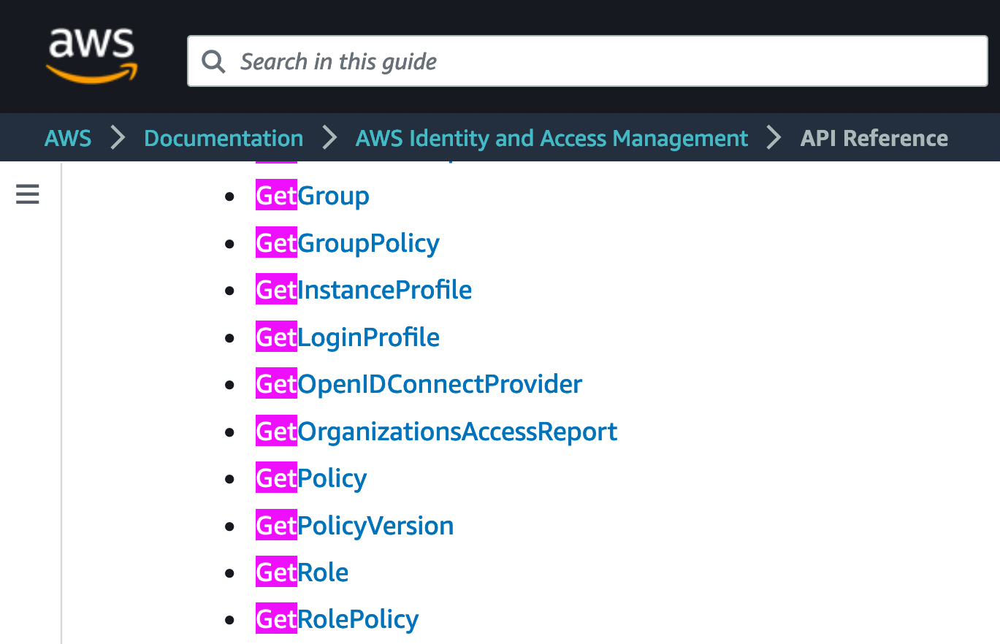

# [balcony](https://github.com/oguzhan-yilmaz/balcony) 

AWS API for us humans. beep boop.


---
# what to talk about

- api operations are actions
- boto3 is only a wrapper for the HTTP API, mostly generated from json
- balcony creates services & resource nodes from operations
    - [Get][ResourceNode]
    - show a map of whats going on  

---
<br/>
<br/>
<br/>

## AWS API Reference - [IAM Actions](https://docs.aws.amazon.com/IAM/latest/APIReference/API_Operations.html)


---
## Example IAM Policy
```json
{
"Statement": [
    {
        "Effect": "Allow",
        "Action": [
            "cloudwatch:Describe*",
            "cloudwatch:Get*",
            "cloudwatch:List*",
            "ec2:DescribeSecurityGroups",
            "ec2:DescribeSubnets",
            "ec2:DescribeVpcs",
            "iam:ListRoles",
            "iam:GetRole",
            "logs:Create*",
        ],
        "Resource": "*"
    }
}
```
---
## boto3 & botocore
- `boto3` is the AWS SDK for Python3
- uses the common functionality in `botocore`

### How to read the IAM policies

```python
import boto3
iam_client = boto3.client('iam')

all_policies = iam_client.list_policies()

# getting a specific policy with its ARN
single_policy = iam_client.get_policy(
    PolicyArn='arn:...'
)
```
---
## boto3 & botocore are only wrappers to HTTP API

- All API endpoints are defined in each services json file
- [git://botocore/botocore/data/](https://github.com/boto/botocore/blob/develop/botocore/data/)


---
## Outline of Boto Service definitions 
 _botocore/data/iam/2010-05-08/service-2.json_

```json
{
  "version":"2.0",
  "metadata": {...},
  "operations":{...},
  "shapes":{...},
  "documentation": "..."
}
```
---
## Boto AWS Service definitions: metadata
```json
"metadata":{
    "apiVersion":"2010-05-08",
    "endpointPrefix":"iam",
    "globalEndpoint":"iam.amazonaws.com",
    "protocol":"query",
    "serviceAbbreviation":"IAM",
    "serviceFullName":"AWS Identity and Access Management",
    "serviceId":"IAM",
    "signatureVersion":"v4",
    "uid":"iam-2010-05-08",
    "xmlNamespace":"https://iam.amazonaws.com/doc/2010-05-08/"
}
```
---
## Boto AWS Service definitions: operations
```json
"operations":{
    "GetPolicy":{
      "name":"GetPolicy",
      "http":{
        "method":"POST",
        "requestUri":"/"
      },
      "input":{"shape":"GetPolicyRequest"},
      "output":{
        "shape":"GetPolicyResponse",
        "resultWrapper":"GetPolicyResult"
      },
      "errors":[
        {"shape":"NoSuchEntityException"},
        {"shape":"InvalidInputException"},
        {"shape":"ServiceFailureException"}
      ],
      "documentation":"<p>Retrieves information about the 
      specified managed policy, including the policy's default 
      version and the..."
    },
}
```
---

## Boto AWS Service definitions: shapes
```json
"shapes":{
    "GetPolicyRequest":{
        "type":"structure",
        "required":["PolicyArn"],
        "members":{
            "PolicyArn":{
            "shape":"arnType",
            "documentation":"The Amazon Resource Name(ARN)
                             of the managed policy"
            }
        }
    }
}
```


---
## quick look at the IAM operations
| get operations | list operations |
|-- |--|
| **Get**Group | **List**Groups |
| **Get**GroupPolicy | **List**GroupPolicies |
| **Get**Policy | **List**Policies |
| **Get**Role | **List**Roles |
| **Get**RolePolicy | **List**RolePolicies |
| **Get**User | **List**Users |

---
## operations can be grouped under their resource names
| Resource Node | Operations |
|-- |--|
| Group | **Get**Group, **List**Groups |
| GroupPolicy | **Get**GroupPolicy, **List**GroupPolicies |
| Policy | **Get**Policy, **List**Policies |
| Role | **Get**Role, **List**Roles |
| RolePolicy | **Get**RolePolicy, **List**RolePolicies |
| User | **Get**User, **List**Users |
---
